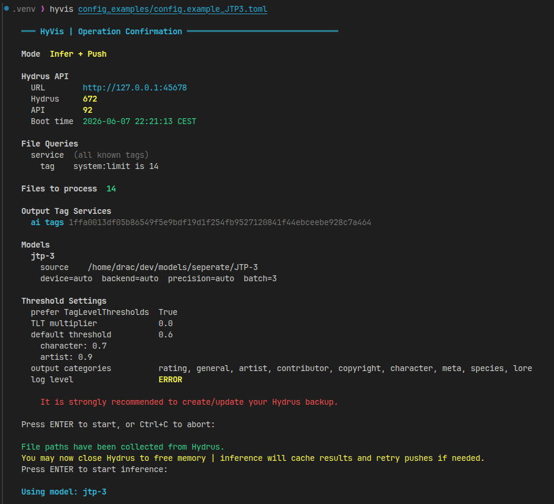
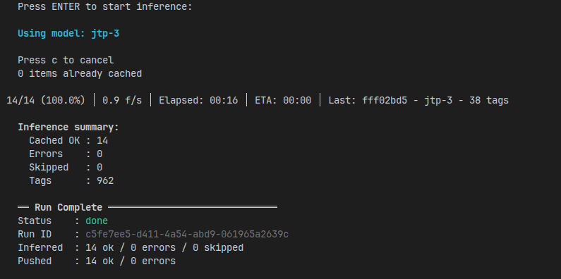
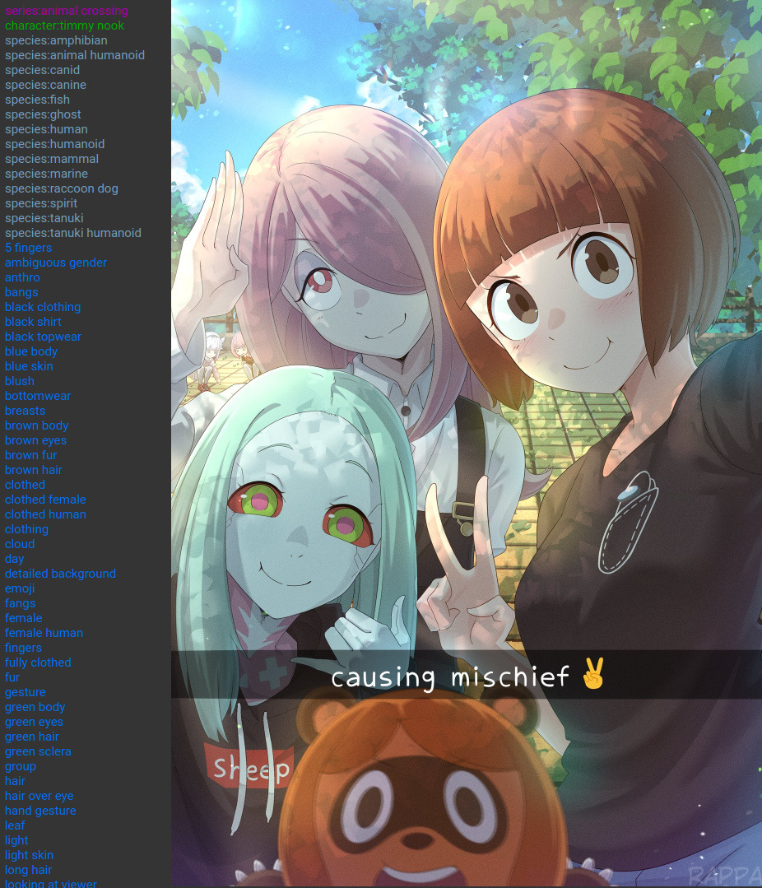
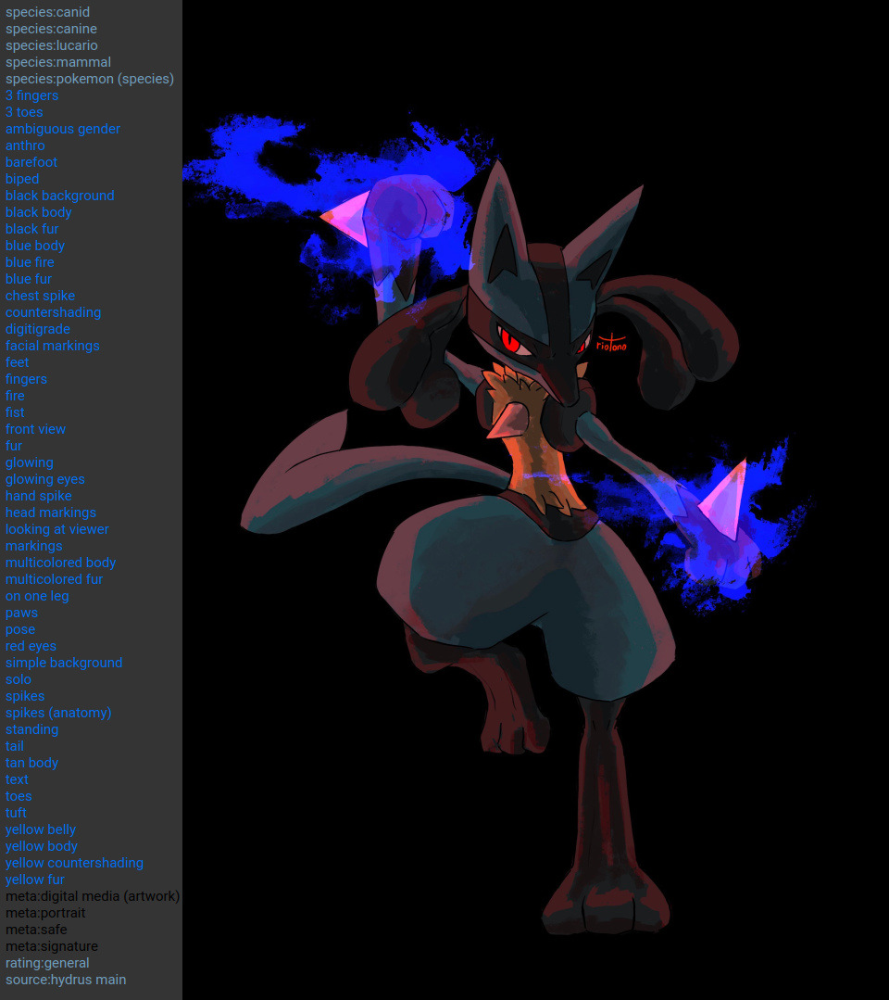

> This README is still a work in progress, there will be some missing information towards the end

# HyVis - Hydrus Tagger

HyVis is a vibecoded project that uses a vibecoded inference backend to let you tag files from Hydrus using a small variety of vision transformers.  

Currently it's expected that Hydrus and Hyvis run on the same machine (or at least Hydrus' file source is on the same machine as HyVis) - HyVis doesn't download actual files from Hydrus over API (yet, or maybe never) and instead gathers the file path from the file metadata and uses that to read files directly.  
While the files are expected to be local, I don't have a NAS setup or similar to tell you if that works or not

I mainly only tested HyVis with workloads that are for my own usecases so if there's any problem please open an issue. Also ***don't forget to make or update Hydrus backups.***

## Installation

### Clone the repository

```bash
git clone https://github.com/DraconicDragon/HyVis.git
cd HyVis
```

### Create a virtual environment (recommended)

(install python if you haven't yet. Recommended is 3.11 or higher, I developed and tested with 3.12; 3.10 might work but mind that it reaches end of life end of 2026)

```bash
python -m venv .venv
```

Activate it:

- Linux/macOS - `source .venv/bin/activate`
- Windows - `.venv\Scripts\activate`

### Install dependencies

**Main:**

```bash
pip install .
```

**Backend:**

HyVis supports PyTorch and ONNX as backend (through vibe, the inference backend library). You can install either both or only one of them. PyTorch is recommended since there's more models with pytorch support than ONNX, but it is likely you may already have models downloaded that are in ONNX, and if you don't want to redownload them in PyTorch format (.safetensors/.pth etc) then you may want to install ONNX backend instead/too.  
PyTorch may or may not also come with less issues for the installation but your experience may vary.

***todo*** | Install instructions for ONNX/PyTorch using CPU and Nvidia GPUs (other GPU types may work if you know your way around that, however I unfortunately don't have amd/intel GPUs to test with. Expect to need to change a few lines of code in worst case)

<ins>PyTorch</ins>

- CPU:

```bash
pip install "torch>=2.7.1" "safetensors>=0.6.2" "timm>=1.0.22" "transformers>=5.0.0" "einops"
```

- Nvidia GPU:

```bash
pip install "torch>=2.7.1" "safetensors>=0.6.2" "timm>=1.0.22" "transformers>=5.0.0" "einops" --index-url https://download.pytorch.org/whl/cu128 --extra-index-url https://pypi.org/simple
```

<ins>ONNX</ins>

> Note: Only install one onnxruntime package at a time - if you choose to switch, then uninstall the old one first using eg `pip uninstall onnxruntime-gpu`

> Note for linux users and onnxruntime-gpu: You may need to install cuda/cudnn from your system package manager for it to work, otherwise it will fallback to CPU

- CPU: `pip install onnxruntime`
- Nvidia GPU: `pip install onnxruntime-gpu`
- May or may not just work:
  - AMD: `pip install onnxruntime-rocm`

#### Updating

1. Open a terminal in the top level HyVis folder (not the hyvis subfolder) and do `git pull`
2. Activate venv
3. Lastly `pip install .`

### Usage

For any questions you can create a new discussion thread on GitHub or ask me on the Hydrus Discord/Matrix server.  

Some info first: HyVis relies on toml files for it's main configurations. You can find example ones in the [config_examples folder](/config_examples/) to get started with (make a copy and edit the copy instead of editing directly), they also include comments that describe their respective settings a bit. They are pretty much all the same besides a few value changes.  

- [config.example.toml](/config_examples/config.example.toml) - the main example toml file, doesn't have some values set.
- [config.example_eva02.toml](/config_examples/config.example_eva02.toml) - example using the WD eva 02 tagger by SmilingWolf; outputs danbooru tags
- [config.example_JTP3.toml](/config_examples/config.example_JTP3.toml) - example using the JTP-3 Hydra model by RedRocket
  - > Note: 1. JTP-3 is not available in ONNX format. 2. It has no `rating` category but does output rating tags to `meta` category (there's no tag prefix filter support for tags yet, only categories)

---

There is also some CLI args you can pass, though usually there isn't much need to use them besides maybe `--infer-only` / `--push-only`. HyVis also provides `--extra-hash-file` with which you can use old [wd-e621-hydrus-tagger](https://github.com/Garbevoir/wd-e621-hydrus-tagger) text files with if you ever wanted to I guess (one sha256 hash per line)

`hyvis --help` / `python -m hyvis --help` output:

```bash
Tag files from Hydrus using image tagging models.

positional arguments:
  CONFIG_PATH           Path to the TOML configuration file.

options:
  -h, --help            show this help message and exit
  --api-url API_URL     Override hydrus.api_url from config.
  --api-key API_KEY     Override hydrus.api_key from config.
  --extra-hash-file EXTRA_HASH_FILE
                        Path to a text file containing one sha256 hash per line. (for wd-e621-hydrus-tagger parity)
  --yes, -y             Skip all confirmation prompts.
  --force, -f           Ignore the DB cache; re-process all matched files.
  --infer-only          Run inference only; do not push results to Hydrus.
  --push-only           Push cached results to Hydrus; skip inference.
  --log-level {DEBUG,INFO,WARNING,ERROR}
                        Logging verbosity (default: config or WARNING).
```

#### Configuration Setup

***todo***

If you for some reason liked the way [wd-e621-hydrus-tagger](https://github.com/Garbevoir/wd-e621-hydrus-tagger) required you to add files or you have old files you'd like to reuse, you should be able to do the same here too by using `--extra-hash-file` cli arg. Unfortunately I haven't really tested this yet

**Supported Models** (will be nicer in future, but for now here full list, ignore the aesthetic scoring models, hyvis does not support them yet): <https://github.com/DraconicDragon/vibe/blob/main/SUPPORTED_MODELS.md>

- Recommended: (todo, recommended thresholds, average of 0.4 default_threshold in toml should be fine for all of them for many tags but without trying to get false positives (range 0.3-0.5+), for JTP3 you might want to increase to 0.5-0.6+)
  - Danbooru Tags (ONNX & PyTorch compatible):
    - Good ol' reliable, but old regardless: `wd-eva02-large-v3`
    - Lighter alternative, also good ol' reliable: `wd-swinv2-v3`
    - newer and similarly lighter alternative: `wdv4-caformer-b36-dbv4-full`
    - newer, as heavy as wd-eva02: `wdv4-eva02-large-patch14-448-dbv4-full`
    - newer, even heavier (6gb memory minimum required, PyTorch only): `wdv4-convnextv2-huge-dbv4-full`
  - E621 Tags: `jtp-3` (PyTorch only)

> **Note**: A caveat of the animetimm models (wdv4-\*/dbv4-full) is that they will require a HuggingFace API key *and also* require you to request access on the models' HF repositories because they are "gated". The request should be automatically accepted, but you will have to fork over your email - If you don't feel like doing that you could maybe ask a kind soul to reupload the models.

<details><summary>HuggingFace API Key Usage</summary>

To use the API key, set the `HF_TOKEN` environment variable when running hyvis.

Windows CMD: `set HF_TOKEN=hf_abcdefg1234567890 && hyvis path/to/config.toml`
Windows Powershell:

```pwsh
$env:HF_TOKEN="hf_abcdefg1234567890"

hyvis path/to/config.toml
```

Most Linux shells: `HF_TOKEN=hf_abcdefg1234567890 hyvis path/to/config.toml`  

</details>

#### Running an operation

***Remember to make backups***

```bash
hyvis path/to/config.toml
```

Showcase on how a run looks like using `jtp-3` as model




<details><summary>JTP-3 Tag outputs + linked images</summary>

(ignore the rating:general and source:hydrus main tags, i added those)

also you can see in second image that JTP 3 will put rating tags (safe, questionable, explicit) in meta category; In the future there might be a better way to prefix tags instead of doing it by category only, its in the todo.md already




</details>

### Todo

See [TODO.md](TODO.md)

Contributions are welcome
