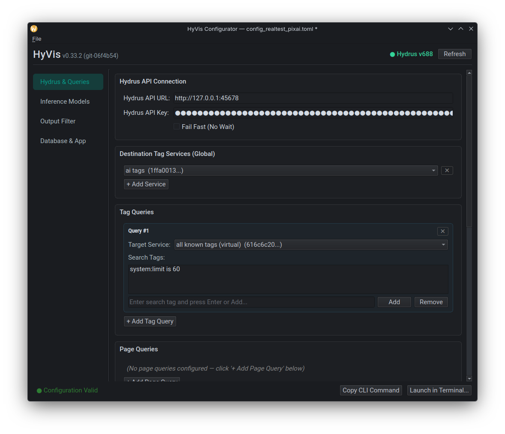
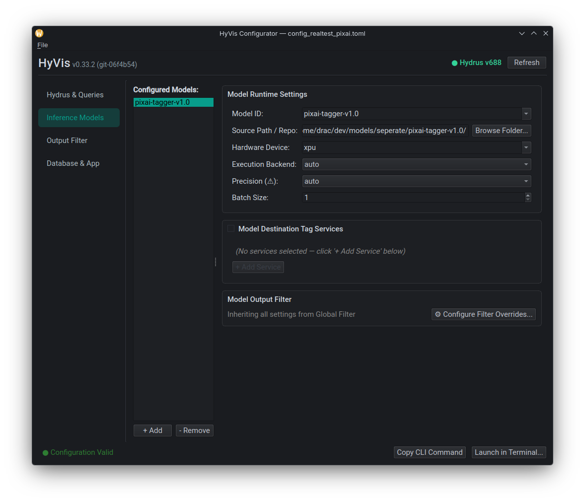
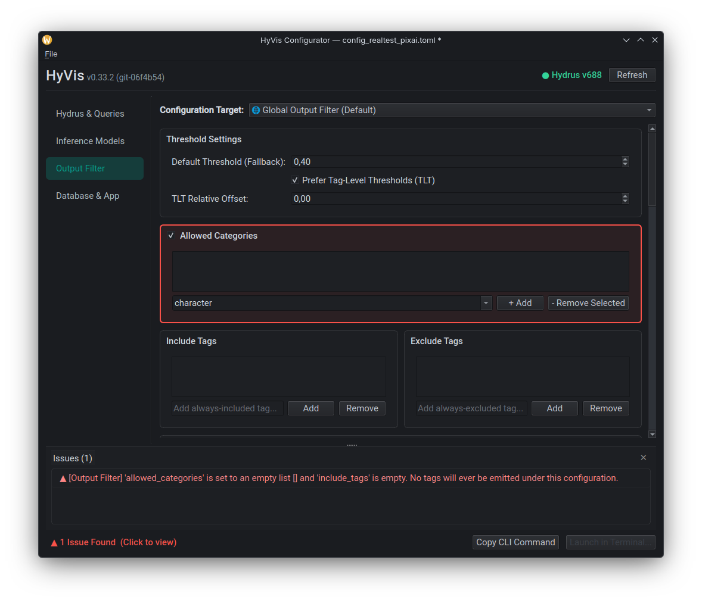
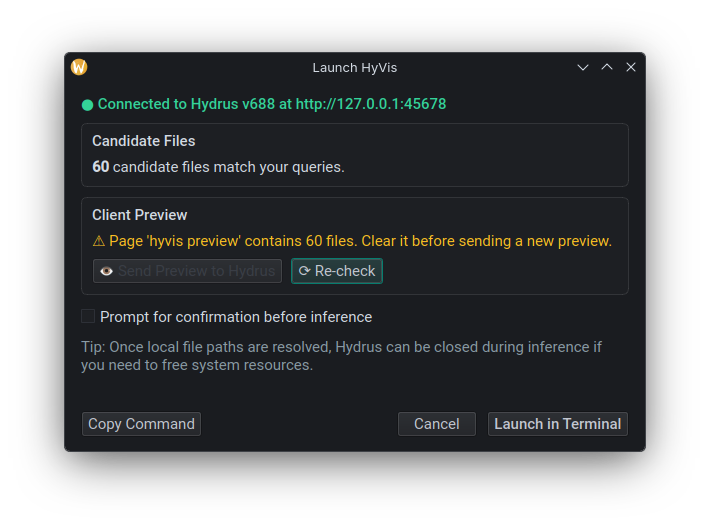

# HyVis - Hydrus Tagger

> [!IMPORTANT]
> **Work in Progress**: HyVis is fully functional and ready to use, but is still in pre-1.0 development. Minor breaking changes to configuration settings or CLI options may occur prior to v1.0 without automated migration paths.

HyVis is a vibecoded local autotagging utility with optional desktop interface for your [Hydrus client](https://hydrusnetwork.github.io/hydrus/). It pairs vision transformer classification models with customizable tag filtering to automatically tag files and push them to Hydrus.

HyVis reads files directly from your disk using paths retrieved from Hydrus file metadata, so it must run on the same machine (or have direct storage access) as your Hydrus client (I don't have a setup to test if files being saved on a NAS or similar works or not). Downloading files over API would be inefficient, so it's not implemented, but if needed, you can open an issue - I may or may not give it a try

> [!NOTE]
> HyVis automatically converts underscores to spaces (preserving kaomojis) before pushing tags to Hydrus: `grea_(shingeki_no_bahamut)` becomes `grea (shingeki no bahamut)`.  
> Non-configurable (open an issue if youw ish this to be configurable).

## Table of Contents

- [Some Key Features](#some-key-features)
  - [Showcase](#showcase)
- [Installation](#installation)
- [Updating](#updating)
- [Usage](#usage)
  - [Desktop Interface (GUI)](#desktop-interface-gui)
  - [HyVis CLI](#hyvis-cli)
  - [Configuration](#configuration)
    - [Supported and Recommended Models](#supported-and-recommended-models)
  - [Useful CLI Flags](#useful-cli-flags)

---

## Some Key Features

- **Desktop GUI (**`hyvis-gui`**)**: PySide6 (Qt) based UI for creating/editing HyVis TOML configuration files - with live Hydrus service sync and real-time validation; Should be a decent UX boost over editing TOMLs directly
- **File Fetching**: Fetch files from Hydrus using [open pages](CONFIGURATION.md#hydruspage_queries) (practically WYSIWYG), [tag search queries](CONFIGURATION.md#hydrustag_queries), or by supplying [`--extra-hash-file`](#extra-hash-file) (for [wd-e621-hydrus-tagger](https://github.com/Garbevoir/wd-e621-hydrus-tagger) compatibility)
- **Client Previews**: [Preview](CONFIGURATION.md#hydruspreview) files that are about to be processed (or were rejected) in Hydrus before tagging begins.
- **Multi-Model Support**: Run [multiple models](CONFIGURATION.md#inferencemodels) sequentially with global or per-model filter overrides
- **Output Filtering**: Comprehensive settings for confidence thresholds, namespace prefix mappings, replacements, subset limits, and category filtering

### Showcase

- GUI

<table align="center">
  <tr>
    <td align="center"><b>Main Page</b></td>
    <td align="center"><b>Models Page</b></td>
  </tr>
  <tr>
    <td></td>
    <td></td>
  </tr>
</table>

<table align="center">
  <tr>
    <td align="center"><b>Output Filter + Error</b></td>
    <td align="center"><b>Launch Dialog</b></td>
  </tr>
  <tr>
    <td></td>
    <td></td>
  </tr>
</table>

- CLI

https://github.com/user-attachments/assets/41b6b7ac-1545-40ce-be31-4fa24bfe13e8

---

## Installation

### 1. Prerequisites

- **git** | [Installation Guide](https://git-scm.com/book/en/v2/Getting-Started-Installing-Git)
- **Python 3.11** ***or higher*** | Python 3.12 is recommended and tested
- Local [Hydrus client](https://hydrusnetwork.github.io/hydrus/introduction.html) to connect to with [Client API enabled](https://hydrusnetwork.github.io/hydrus/client_api.html).

### 2. Clone the Repository

```bash
git clone https://github.com/DraconicDragon/HyVis.git
cd HyVis
```

### 3. Create and Activate a Virtual Environment

```bash
python -m venv .venv
```

- **Linux/macOS:** `source .venv/bin/activate`
- **Windows (CMD):** `.venv\Scripts\activate.bat`
- **Windows (PowerShell):** `.venv\Scripts\Activate.ps1`

### 4. Install HyVis

Install HyVis and its core dependencies:

```bash
# Core CLI only
pip install .

# With Desktop GUI
pip install ".[gui]"
```

### 5. Install an Inference Backend

HyVis supports PyTorch and ONNX backends. You do not need to install both; choose the one that matches the models you plan to run if you want to save space. PyTorch is recommended for broader model compatibility.

> **Hardware Support Note:** HyVis is made and tested on Nvidia hardware. AMD ROCm and Intel GPU configurations are untested since I don't have the respective hardware. If you run HyVis on these platforms, you may need to install the corresponding backend packages manually (e.g., `onnxruntime-rocm`). It is possible that a few-line code change may or may not be needed to support other hardware-specific libraries.  
Feedback on alternative hardware configurations is welcome.

#### Option A: PyTorch Backend (Recommended)

- **CPU Only:**

  ```bash
  pip install "torch>=2.7.1" "safetensors>=0.6.2" "timm>=1.0.22" "transformers>=5.10.0" "einops>=0.8.0"
  ```

- **NVIDIA GPU (CUDA):**

  ```bash
  pip install "torch>=2.7.1" "safetensors>=0.6.2" "timm>=1.0.22" "transformers>=5.10.0" "einops>=0.8.0" --index-url https://download.pytorch.org/whl/cu128 --extra-index-url https://pypi.org/simple
  ```

> NOTE: If you have a Maxwell (eg: GTX 9xx), Pascal (GTX 10xx/Tesla P100/P40) or Volta (V100) GPU (or older), then you **MUST** switch out `cu128` in the install command above to `cu126` or `cu124`.  
`cu128` dropped support for sm_50, sm_60 and sm_70.
Otherwise your GPU should support cu128 and you may even increase value to `cu130` or `cu132` - if your drivers are up to date (I don't know about any practical differences)

#### Option B: ONNX Backend

*Note: Some models, such as [JTP-3](SUPPORTED_MODELS.md#jtp-3) / [Hydra 3.5](SUPPORTED_MODELS.md#hydra-35) or [animetimm's dbv4 ConvNeXt v2 Huge](SUPPORTED_MODELS.md#at-convnextv2-huge-dbv4-full), are not available in ONNX format.*

- **CPU Only:**

  ```bash
  pip install "onnxruntime>=1.17.3"
  ```

- **NVIDIA GPU:**

  ```bash
  pip install "onnxruntime-gpu>=1.17.3"
  ```

> On Linux you may need to install CUDA and cuDNN manually through your package manager or whatever the correct method is for your distro.

---

## Updating

You can update HyVis by using the commands below *or* use the update\.sh script (Linux/macOS) or update.bat (Windows) in the repository root.

```bash
cd HyVis
source .venv/bin/activate   # Linux/macOS
# .venv\Scripts\activate.bat      # Windows CMD
# .venv\Scripts\Activate.ps1      # Windows PowerShell

git pull
pip install .
```

---

## Usage

### Desktop Interface (GUI)

You can launch the desktop configurator to visually configure settings, inspect candidate files, and launch tasks.
While the venv is activated:

```bash
# Without TOML
hyvis-gui

# With TOML
hyvis-gui path/to/config.toml
```

Two things you may want to know about:

- Tooltips are on practically every element and show on mouse hover
- You can interact with the issue items in the issues panel though left-clicking, which will take you to the erroneous page/widget
  - Right-clicking will allow you to copy the issue message

### HyVis CLI

You can run the HyVis CLI utility through `hyvis` and by passing the path to your configured TOML file:

```bash
hyvis path/to/config.toml
```

### Configuration

HyVis uses TOML configuration files to define your Hydrus API connection, search rules, models and output filtering.  

To get started you can create a copy of one of the examples in the `config_examples/` directory and modify the copy to your liking.

For a comprehensive list of all configuration options, see the [Configuration Guide](CONFIGURATION.md). You may want to have this open while checking the example configs and editing/creating your own.

**Available example configs:**

- [`config.example.toml`](config_examples/config.example.toml) - Example config file with pretty much all available options + some comments. Reading the configuration guide over the comments is preferred though

- [`tagging_example.toml`](config_examples/tagging_example.toml) - Generic example config for general tagging of files using a model with basic default settings - *likely a good starting point for most users*

- [`dan_rating_only.toml`](config_examples/dan_rating_only.toml) - Example config that utilizes output filter options to only send the rating tag with the highest confidence score

- [`tagging_multi_model.toml`](config_examples/tagging_multi_model.toml) - A more advanced example config that uses 2 models (one outputting Danbooru tags, the other E621 tags) to tag files and puts each model's output in separate tag services

#### Supported and Recommended Models

Please see [SUPPORTED_MODELS.md](SUPPORTED_MODELS.md)

### Useful CLI Flags

- `-h`, `--help`
  Show the help message and all available CLI flags.
- `-y`, `--yes`
  Skip all interactive confirmation prompts.
- `-f`, `--force`
  Ignore the local database cache and re-process all matching files.
- `--infer-only`
  Run model inference and save results to the database cache, but do not send any tags to Hydrus.
- `--no-preview`
  Skip any [configured page previews](CONFIGURATION.md#hydruspreview).
- `--push-only`
  Skip file queries and inference; immediately push any pending tags sitting in the local database queue to Hydrus.
- `--clear-cache`
  Clear the raw prediction cache from the database and run `VACUUM` to reclaim disk space.
- `--no-wait`
  Do not wait for Hydrus if it is offline/unreachable; fail fast instead.
- `--api-url` / `--api-key`
  Override the [connection parameters](CONFIGURATION.md#hydrus) specified in your TOML config. Useful for running the same config against multiple Hydrus clients.
- <a id="extra-hash-file"></a>`--extra-hash-file PATH`
  For compatibility with [wd-e621-hydrus-tagger](https://github.com/Garbevoir/wd-e621-hydrus-tagger) Process a text file containing one SHA256 hash per line.

>[!TIP]
> If a run was interrupted or you ran with `--infer-only`, all tags remain safely queued in the database. Run `hyvis <config.toml> --push-only` whenever you are ready to send them to Hydrus.

<!-- ## FAQ

There would be frequently asked questions here, but there are none, because I can't come up with any and nobody asked yet 

Q: Hydrus executable manager compatibility?
A: Uhhhhhhh, need hyvis daemon
-->
